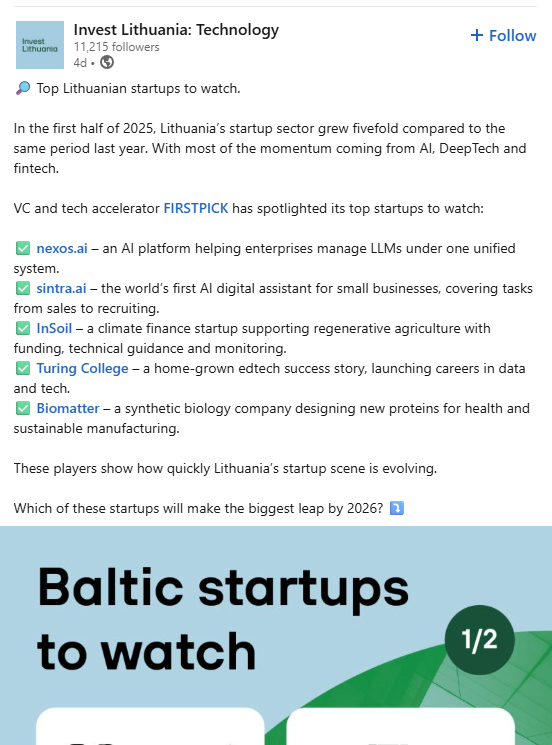
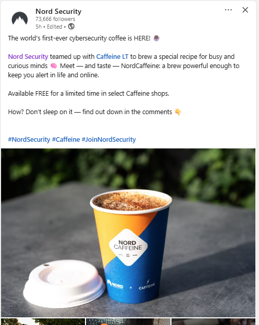
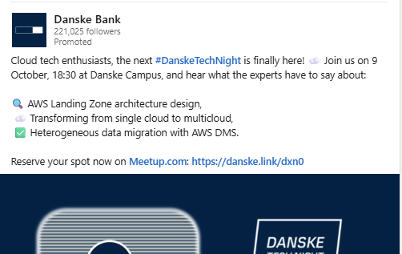

   # Sprint 1:

   ## `1. AI hunting for LinkedIn!`
1. Tripple benefit. Icons at the end.
 
   
     
2. Long dash sign, icons instead of bulletpoints.
   
    

3. Concerned about this one.
   
    
4. Long dash, consequent tripples.

    
5. Long dash, tripple bullet. Ai like icon sused.
   
    
6. Dont know...
   
    
7. Many icons, tripples (five-pples?)

    
8. Long dash, icons.
   
    
9.  Icons looks non human like.
    
    
10. Text structure, bolding. Text goes longer, then non human like icons starts to popup.
    
    
