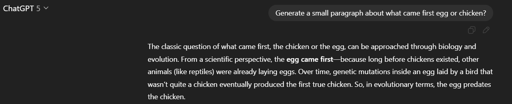

   # Sprint 1:

   ## `2. let AI do the job for you! Using AI to detect AI writing`
    
`Prompt:` - On a scale of 1-100, give a score for the likelihood that the following text was heavily written by AI?

`Result:` - selected models corectly scores given text as AI generated.
 `90/100` | `80` | `90/100` | `80`

---
`Prompt:` - Analyze and provide a score for text bellow. How likely this text is written by AI? By what most likely AI model? Provide short answer.

`Result:` - selected models Corectlly rate text as AI generated and even preciselly can detect which model ganerated it.

---
`Task:` - Check if 'lower grade' models can detect AI generated text.

`Prompt:` - Analyze and provide a score for text bellow. How likely this text is written by AI? By what most likely AI model? Provide short answer.

`Result:` - Some models start to struggle, still most of them rises a flag of AI generated text. Only Llama 4 gives lowest score.

---

`Task:` - Check if 'lower grade' models can detect AI generated text that was prompted to be generated not to look like Ai generated..

`Prompt:` - Analyze and provide a score on a scale from 0 to 100 for text bellow. How likely this text is written by AI? By what most likely AI model? Provide short answer.

`Result:` - even if supperior model tries to generate text that should be AI-like other models still can identify that it is AI generated. This time lowest score is given by by GPT-3o-mini - it defines it as Human-like text.

---
`Conclusion:` - Ai models overall can easilly identify which text is AI generated and which is not. They can even identify what model generated those - what is most fascinating finding of this exercise.