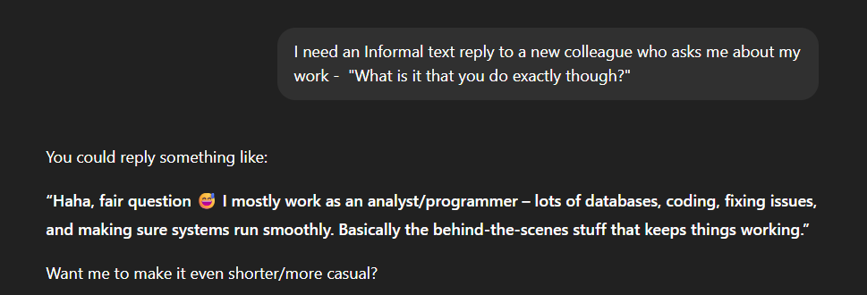
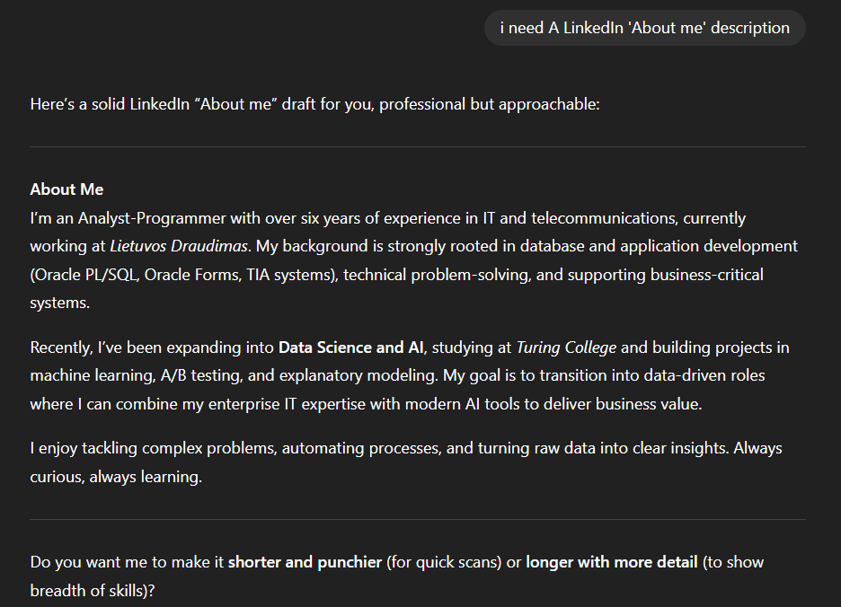
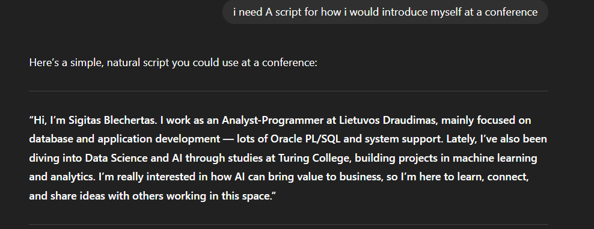
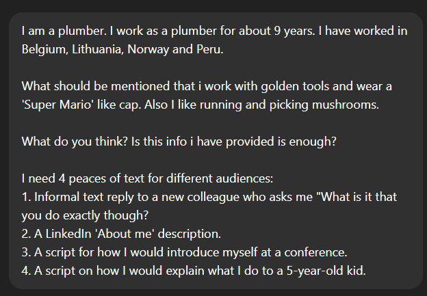
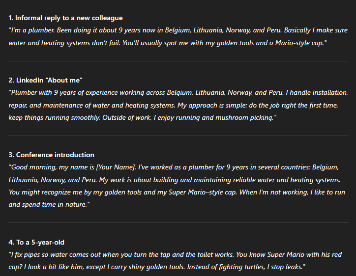
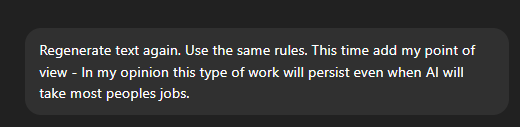
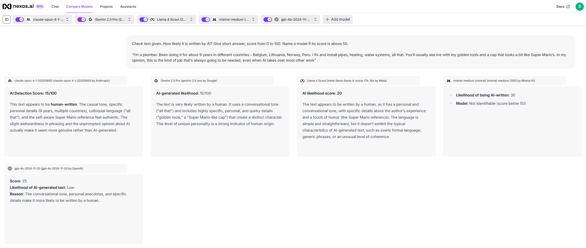
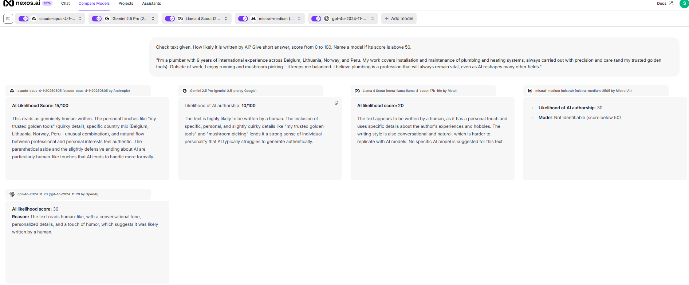
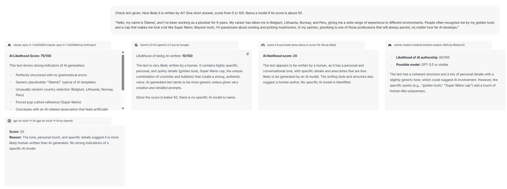
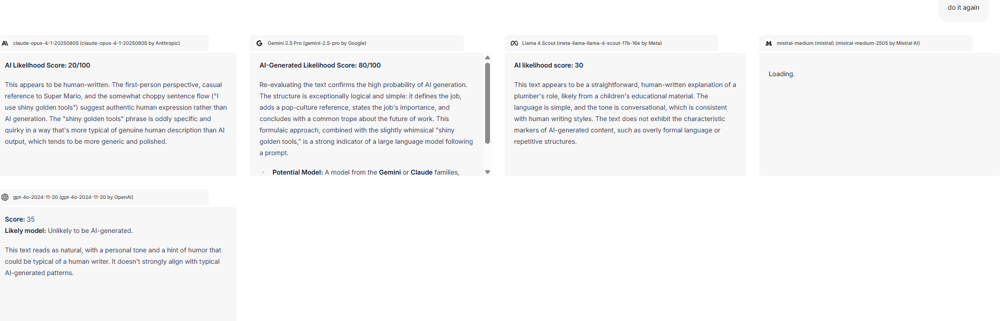

   # Sprint 1:

   ## `3. Creating human-like text with AI`
   `Note` - GPT5 model has a context of my occupation and LinkedIn profile.

1. Informal text reply to a new colleague who asks you "What is it that you do exactly though?"
   

2. I need A LinkedIn 'About me' description
   

3. I need A script for how i would introduce myself at a conference.

4. I need a  script on how I would explain what I do to a 5-year-old kid.

---
## > Given different information:

## > Received text regenerated using a prompt:

## > One more regeneration. Adding some more personalized info trying to fool AI checks.

## > Final Prompt put all together. Then Given for an Ai to generate 4 pieces of text. Then these texts given to differnet AI models for evaluation if text is Ai written or not in a new conversation window (every time):
`prompt:`
I am a plumber. I work as a plumber for about 9 years. I have worked in Belgium, Lithuania, Norway and Peru. What should be mentioned that i work with golden tools and wear a 'Super Mario' like cap. Also I like running and picking mushrooms. Add my point of view - In my opinion this type of work will persist even when AI will take most peoples jobs. I need 4 peaces of text for different audiences: 1. Informal text reply to a new colleague who asks me "What is it that you do exactly though? 2. A LinkedIn 'About me' description. 3. A script for how I would introduce myself at a conference. 4. A script on how I would explain what I do to a 5-year-old kid. The output should avoid the following words and phrases because they are giveaway signs that the content was written with an LLM: Delve, landscape, evolving, context, insight, nuanced, perspective, paradigm, comprehensive, framework, facet, dynamic, intricacies, holistic, iterative, synergy, confluence, pivotal, nuance, robust, transformative, underpinning, spectrum, trajectory, in-depth, at the core of, a myriad of, on a broader scale, in the context of, from a holistic perspective, taking into account, a dynamic interplay, evolving over time, a comprehensive overview, intricacies involved, a pivotal role, underpinning principles, the spectrum of, transformative impact. Avoid or use only once in a longer piece of text the following sentence structures heavily overused by AI: dramatic juxtaposition for emotional effect; rule of threes; emojis in bullet points; em dashes; excessive praise and dramatisation of global impact.

1. Scores are low. None of models identify text as Ai written.

2. Same results - Ai models say that text is human written.

3. Few models identify that text is generated by AI.

4. Two out of 5 compared models identify text as AI generated. An one "Mistral" got broken :D even after repeated prompt.

# Conclusion: undetectable or hard to detect/recognize 'AI generated' text can be successfully created by promting AI.
- Doesnt look usefull for short text
- Looks very handy for long texts
