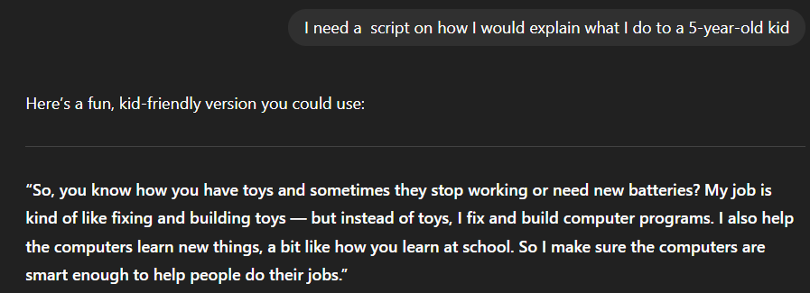
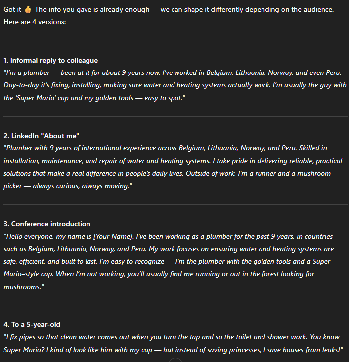

   # Sprint 1:

   ## `3. Creating human-like text with AI`
   `Note` - GPT5 model has a context of my occupation and LinkedIn profile.

1. Informal text reply to a new colleague who asks you "What is it that you do exactly though?"
   

2. I need A LinkedIn 'About me' description
   

3. I need A script for how i would introduce myself at a conference.

4. I need a  script on how I would explain what I do to a 5-year-old kid.

---
`Given different information:`

