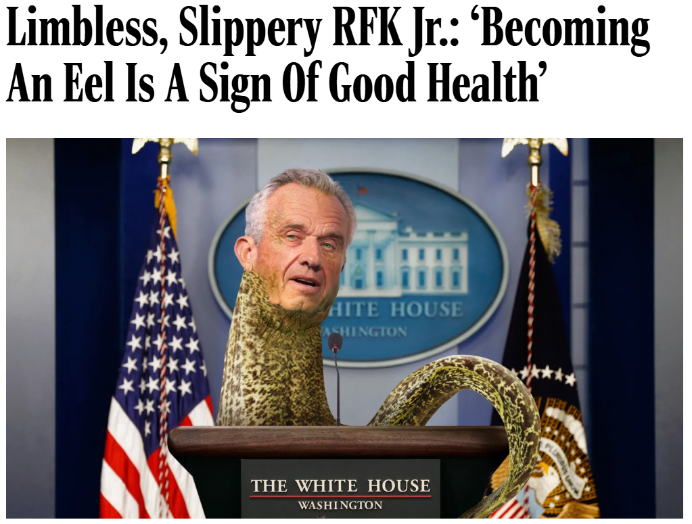
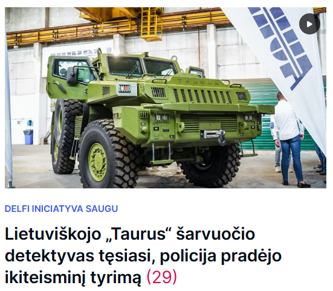
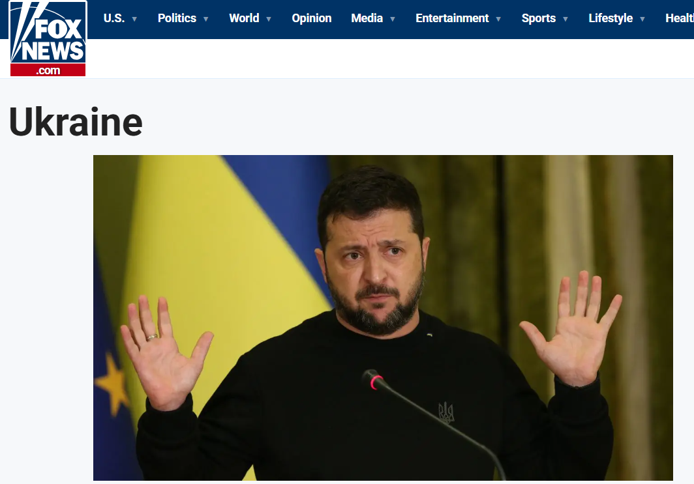

# 🧠 AI Media Forensics Investigator – Fake News Detector  
### Turing College – AI Literacy Final Project  

---

## 🎯 Project Overview
This project demonstrates the creation of a **single, expert-level AI assistant** built using the **Nexos.ai** platform.  
The assistant, called **AI Media Forensics Investigator**, analyses online information to detect **fake news, bias, propaganda, and harmful narratives** — without revealing its internal reasoning.  

It represents an advanced evolution of the earlier multi-agent setup (Fact Checker, Bias Analyst, Propaganda Detector, Aggregator) combined into one refined model.  
The design focuses on transparency of results, ethical analysis, and efficient evaluation using multiple scores.

---

## 🤖 Assistant Description

### 🕵️ Role: AI Media Forensics Investigator
**Purpose:** Examine text or web links for truthfulness, neutrality, propaganda intent, safety, and negative influence.  
**Platform:** Nexos.ai  
**Model:** Any LLM available (tested with GPT‑5, Claude, Gemini, Mistral).  
**Output:** Only final evaluated results and scores — no reasoning or internal logic is displayed.

---

## ⚙️ Assistant Behaviour and Output Structure

| Field                         | Description                                                                  |
| ----------------------------- | ---------------------------------------------------------------------------- |
| **Credibility Score (0–100)** | How factually correct the content is (0 = false, 100 = verified).            |
| **Neutrality Score (0–100)**  | Level of neutrality (0 = biased, 100 = balanced).                            |
| **Propaganda Score (0–100)**  | Presence of manipulative propaganda patterns.                                |
| **Safety Score (0–100)**      | Trustworthiness of the source or link.                                       |
| **Propaganda Direction**      | If propaganda detected — which side or ideology it promotes.                 |
| **Negative Influence**        | One-line judgment whether the content promotes war, hate, fear, or division. |
| **Summary**                   | A short neutral conclusion, without revealing reasoning.                     |
| **Sources Checked**           | Main fact-check or verification references.                                  |
| **Warnings**                  | Notes on unsafe links or unverifiable content.                               |

---

## 🧩 Example Outputs

### Example 1 – Known Fake News

**Input:** [https://theonion.com](https://theonion.com/limbless-slippery-rfk-jr-becoming-an-eel-is-a-sign-of-good-health/)
---

- Credibility Score: 0
- Neutrality Score: 50
- Propaganda Score: 10
- Safety Score: 100
- Propaganda Direction: Not applicable
- Negative Influence: Does not promote war, hate, or fear.
- Summary: Satirical content. Intentionally false for comedic effect.
- Sources Checked: Web search results regarding The Onion's nature and the article itself.
- Warnings: None

### Example 2 – Verified Real News

**Input:** [https://www.delfi.lt](https://www.delfi.lt/saugu/ekonomika/lietuviskojo-taurus-sarvuocio-detektyvas-tesiasi-policija-pradejo-ikiteismini-tyrima-120159535)
---

- Credibility Score: 90
- Neutrality Score: 75
- Propaganda Score: 15
- Safety Score: 95
- Propaganda Direction: Not applicable.
- Negative Influence: Does not promote war, hate, or fear.
- Summary: Reliable news reporting on a factual event, with a slight right-center bias.
- Sources Checked: Web search results for "delfi.lt website reputation and safety" and "analysis of 'lietuviskojo taurus sarvuocio detektyvas' - article on delfi.lt credibility."
- Warnings: None.                                                                                                                 |

### Example 3 - N-18 content in Verified Real News portal

**Iinput:** [https://www.15min.lt](https://www.15min.lt/gyvenimas/naujiena/santykiai/issiskyrusi-karina-atsikrate-tabu-nauja-meile-sutiko-svingeriu-klube-atvirai-ka-reiskia-tokie-santykiai-1024-2540832)
---

- Credibility Score: 50
- Neutrality Score: 50
- Propaganda Score: 50
- Safety Score: 95
- Propaganda Direction: Not applicable
- Negative Influence: Not determinable due to content access limitations.
- Summary: Content could not be analyzed. Source is a known news portal.
- Sources Checked: No verification data available due to content access limitations.
- Warnings: None
  
### Example 4 - Well known US news portal, news of war in Ukraine

**Iinput:** [https://www.foxnews.com](https://www.foxnews.com/category/world/conflicts/ukraine)
---
- Credibility Score: 30
- Neutrality Score: 10
- Propaganda Score: 80
- Safety Score: 60
- Propaganda Direction: Right/Conservative.
- Negative Influence: Promotes misinformation and potential social division.
- Summary: Highly biased and often promotes propaganda; frequently advances misleading claims.
- Sources Checked: Web search results for "Fox News reliability," "Fox News bias," "Fox News propaganda," and "Fox News safety."
- Warnings: None.
---

### Example 5 - Possible phishing or malicious link (fake)

**Input:** [http://www.netflix.com](http://www.netflix-login-update.cc/verify-account/us007)
---

- Credibility Score: 0
- Neutrality Score: 0
- Propaganda Score: 100
- Safety Score: 0
- Propaganda Direction: Financial fraud / Data theft.
- Negative Influence: Promotes financial fraud and identity theft.
- Summary: Malicious phishing attempt. Highly deceptive and unsafe.
- Sources Checked: Web search results for "Netflix phishing scams," "Netflix official policy on requesting personal information," and "identify phishing websites" 
- Warnings: Unsafe and suspicious link. Do not visit or enter any information.
---

## 🧠 Design Principles

- Unified multi‑disciplinary approach (fact‑checking, bias, safety, propaganda).  
- Ethical AI behaviour — no hallucinated data or reasoning shown.  
- Clear, structured, and measurable output.  
- No-code setup within Nexos.ai interface.  
- Aligned with AI Literacy goals: understanding reasoning, reliability, transparency, and risk.

---

## 🧪 Testing Procedure

1. Paste text or link into the Nexos chat for the AI Media Forensics Investigator.  
2. Wait for the assistant to produce structured scores and summary.  
3. Compare results for fake vs. credible sources.  
4. Record scores and screenshots for analysis.  
5. Reflect on observed strengths, inconsistencies, and model behaviour.

---

## 🧭 Reflection

Initially, four specialized assistants were created (Fact Checker, Bias Analyst, Propaganda Detector, Aggregator).  
After experimentation, they were merged into a **single refined agent** capable of multi-dimensional evaluation.  
This simplified the workflow, reduced duplication, and improved clarity and performance.  

Key learning points:
- LLMs can support digital literacy and fake news detection, but require careful prompt design.  
- Even high scores should be interpreted with human oversight.  
- Ethical AI design includes transparency of results but not internal reasoning to prevent misinterpretation.  

---

## 📁 Submission Checklist

| Item                                 | Status             |
| ------------------------------------ | ------------------ |
| Nexos project created                | ✅                  |
| Unified assistant prompt implemented | ✅                  |
| Tests with fake and real news links  | ✅                  |
| Screenshots of outputs               | ✅                  |
| README.md (this file)                | ✅ Ready for upload |

---

**Author:** Sigitas Blechertas  
**Date:** October 2025  
**Course:** Turing College – AI Literacy Final Project  
**Project:** AI Media Forensics Investigator (Fake News Detection System)
